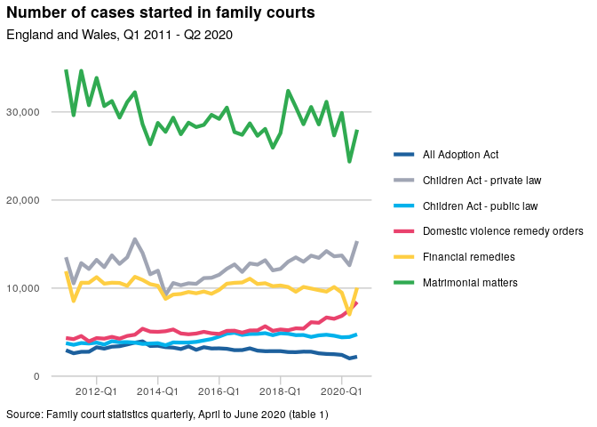
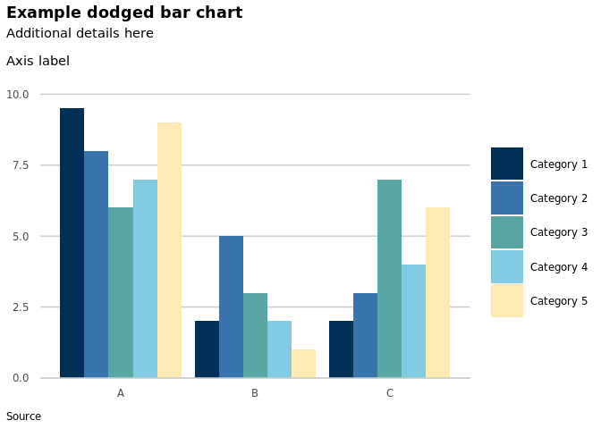
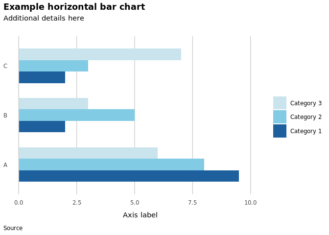

<!-- README.md is generated from README.Rmd. Please edit that file -->

# mojchart

<!-- badges: start -->

<!-- badges: end -->

mojchart is an R package to help with formatting charts in ggplot2. It
includes a theme function based on [Government Statistical Service (GSS)
guidance](https://gss.civilservice.gov.uk/policy-store/introduction-to-data-visualisation/)
and colour schemes based on [MoJ corporate
branding](https://intranet.justice.gov.uk/guidance/communications/branding-templates/)
(MoJ internal link).

Please note that mojchart is in development.

## Installation

You can install mojchart with:

``` r
install.packages("devtools")
devtools::install_github("moj-analytical-services/mojchart")
```

## Main functions

The package provides the following custom ggplot2 functions:  

  - `theme_gss()` - a theme based on GSS guidance;  
  - `scale_colour_moj()` and `scale_fill_moj()` for applying mojchart
    colour palettes.

To access the package colour palettes without using the scale
functions:  

  - `moj_palette()` returns a colour palette as a vector.  

To obtain the hex codes for individual colours:  

  - `moj_colours()` provides MoJ corporate colours;  
  - `palette_colours()` provides the colours used in the mojchart colour
    palettes.  

To display colour palettes:

  - `display_palette()` displays a vector of colour hex codes;
  - `display_scheme()` displays all the colour palettes within a colour
    scheme.

The function help pages (accessed using `?` or `help()` in RStudio)
contain full details and examples.

## GSS theme

The main principle behind `theme_gss()` is to simplify the chart and
remove unecessary formatting. The theme allows for a main title plus a
subtitle for statistical details. The data source can be shown in the
caption below the chart.

Axis labels should be horizontal according to both the [GSS
guidance](https://gss.civilservice.gov.uk/policy-store/introduction-to-data-visualisation/#section-2:~:text=Things%20to%20include%20with%20your%20graph)
and [ONS web accessibility
guidance](https://style.ons.gov.uk/writing-for-the-web/web-accessibility/accessible-charts/).
To that end, `theme_gss()` suppresses the ggplot2 y axis label; a label
can instead be included within the ggplot2 subtitle if required. This is
demonstrated by the second of the example charts [below](#examples).

`theme_gss()` includes parameters to show or hide the x axis label and x
axis tick marks. Setting the parameter `flipped = TRUE` reverses the x
and y axes for use with `coord_flip()`.

## Colour palettes

The package provides colour palettes for discrete data, grouped into
several colour schemes. There are two types of colour scheme: vibrant
and muted. The vibrant schemes use MoJ corporate colours and are
recommended for lines or points. The muted schemes are based on MoJ
colours but with reduced saturation. They are intended for shading
areas, such as for bar charts, in line with the [GSS guidance on the use
of
colour](https://gss.civilservice.gov.uk/policy-store/introduction-to-data-visualisation/#section-9).
Each colour scheme consists of six colour palettes, containing from one
to six colours. Six colours is probably around the maximum to keep
charts clear and accessible (see [below](#accessibility)).

For sequential colour palettes or continuous data, you could look at the
inbuilt [ggplot2 options](https://ggplot2-book.org/scale-colour.html),
or try the
[colorspace](https://cran.r-project.org/web/packages/colorspace/vignettes/colorspace.html)
package.

`scheme_names()` shows the available colour schemes.

``` r
library(mojchart)
scheme_names()
#> [1] "muted1"   "muted2"   "muted3"   "vibrant1" "vibrant2"
```

You can use `scale_colour_moj()` or `scale_fill_moj()` to apply a colour
palette to a ggplot2 chart, passing the number of colours and the name
of a colour scheme as arguments. There is an optional `order` parameter
to change the colour order.

To obtain a colour palette as a vector, use `moj_palette()`, again
specifying the number of colours and the colour scheme. The
`display_palette()` function displays the colours.

``` r
pal <- moj_palette(n = 5, scheme = "muted3")
pal
#> mojdarkblue    midblue1       teal2       pink1     yellow1 
#>   "#003057"   "#3975ac"   "#59a6a4"   "#f3bee0"   "#feebb3"
display_palette(pal)
```


The `display_scheme()` function shows all the colour palettes within a
colour scheme, as shown for every colour scheme
[here](man/additional-documentation/schemes.md).

## Accessing individual colours

`moj_colours()` provides the hex codes for all MoJ corporate colours.
`palette_colours()` provides the colours used in the mojchart colour
palettes. Running either function with no arguments returns a vector
containing all the function’s colours. Passing the names of individual
colours returns just those.

``` r
moj_colours("mojblue", "mojgreen")
#>   mojblue  mojgreen 
#> "#1d609d" "#30aa51"
```

## Accessibility

The mojchart colour palettes aim to be accessible to those with the most
common forms of colour blindness, but accessibility does decrease the
more colours you use.

Additionally, note the following from the GSS guidance:

> Never use colour to specify something on its own. People often print
> documents in black and white. Some people are colour-blind. It’s
> important not to rely on colour alone to add meaning to your data.

Similar points are made in web accessibility guidance from the [Office
for National Statistics
(ONS)](https://style.ons.gov.uk/writing-for-the-web/web-accessibility/accessible-charts/)
and the [Government Digital Service
(GDS)](https://www.gov.uk/service-manual/helping-people-to-use-your-service/understanding-wcag).

For line charts, the GSS recommends labelling lines directly where
possible rather than using a legend. The
[directlabels](http://directlabels.r-forge.r-project.org/) package
provides one way to implement this in R.

Below are two resources to help assess colour blindness accessibility.  

  - To simulate how an image file could appear to individuals with forms
    of colour blindness:  
    <https://www.color-blindness.com/coblis-color-blindness-simulator/>
  - To simulate the appearance of a colour palette of hex codes:  
    <https://davidmathlogic.com/colorblind/>

## Examples

The examples below show the use of `theme_gss()`, `scale_colour_moj()`
and `scale_fill_moj()`, together with other ggplot2 functions, to format
complete charts. The data frames for the charts are produced by two
mojchart functions, `familystarts_reduced()` and `bars()`.

### Example line chart

  - In this example note that the line thickness has been increased in
    `geom_line()` so that the colours stand out more, making the
    categories easier to identify.

<!-- end list -->

``` r
library(mojchart)
library(ggplot2)
library(xts)
library(scales)
ggplot(familystarts_reduced(6), aes(x = year_qtr, y = count, colour = case_type)) +
  geom_line(size = 1.5) +
  labs(title = "Number of cases started in family courts",
       subtitle = "England and Wales, Q1 2011 - Q2 2020",
       caption = "Source: Family court statistics quarterly, April to June 2020 (table 1)") +
  scale_y_continuous(expand = expansion(mult = c(0, 0.05)), label = comma) +
  scale_x_yearqtr(labels = date_format("%Y-Q%q")) +
  expand_limits(y = 0) +
  theme_gss(xticks = TRUE) +
  scale_colour_moj(6, scheme = "vibrant1", order = c(1, 3, 2, 6, 4, 5))
```

<!-- -->

### Example bar chart

``` r
ggplot(bars(5), aes(x = col1, y = col3, fill = col2)) +
  geom_col(position = "dodge") +
  labs(title = "Example dodged bar chart",
       subtitle = "Additional details here\n\nAxis label",
       caption = "Source") +
  scale_y_continuous(expand = expansion(mult = c(0, 0.05))) +
  expand_limits(y = 10) +
  theme_gss() +
  scale_fill_moj(5, scheme = "muted2")
```

<!-- -->

### Example flipped bar chart

``` r
ggplot(bars(3), aes(x = col1, y = col3, fill = col2)) +
  geom_col(position = "dodge") +
  coord_flip() +
  labs(title = "Example flipped bar chart",
       subtitle = "Additional details here\n",
       caption = "Source",
       y = "Axis label") +
  scale_y_continuous(expand = expansion(mult = c(0, 0.05))) +
  expand_limits(y = 10) +
  guides(fill = guide_legend(reverse = TRUE)) +
  theme_gss(flipped = TRUE, xlabel = TRUE) +
  scale_fill_moj(3, scheme = "muted1")
```

<!-- -->
