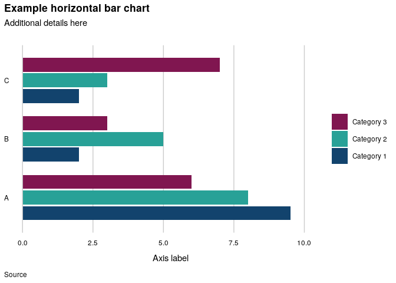

<!-- README.md is generated from README.Rmd. Please edit that file -->

# mojchart

<!-- badges: start -->

<!-- badges: end -->

mojchart is an R package to help with formatting charts in ggplot2. It
includes colour schemes based on [MoJ corporate
branding](https://intranet.justice.gov.uk/guidance/communications/branding-templates/)
and a theme function based on [Government Statistical Service (GSS)
guidance](https://gss.civilservice.gov.uk/policy-store/introduction-to-data-visualisation/).

## Installation

To install, you need to have set up a GitHub personal access token. For
details, see the [Analytical Platform
guidance](https://user-guidance.services.alpha.mojanalytics.xyz/github.html#private-r-packages-on-github-pat-authentication).

Then you can install with:

``` r
install.packages("devtools")
devtools::install_github("moj-analytical-services/mojchart")
```

## Main functions

The package provides the following custom ggplot2 functions:  

  - `scale_colour_moj()` and `scale_fill_moj()` for applying predefined
    mojchart colour palettes, and  
  - `theme_gss()` - a theme based on GSS guidance.  

To access palettes and individual colours without using the scale
functions, use the functions below.  

  - `moj_palette()` returns a single colour palette as a vector.  
  - `moj_colours()` provides MoJ corporate colours.  
  - `palette_colours()` provides all colours used by the mojchart
    palettes.  

See the individual function help files for details and examples.

## Colour palettes

The package includes several colour schemes for discrete data, split
into two types: muted and vibrant. The muted schemes are recommended for
shading areas, such as for bar charts, since they are are easier on the
eye. The vibrant schemes are recommended for lines or points, where
vibrant colours are easier to distinguish. The vibrant schemes use
colours taken directly from MoJ corporate branding, whereas the muted
colours are modified versions with reduced saturation.

Each colour scheme is comprised of six palettes, for charts needing from
one to six colours. If you need more colours than this, first consider
the accessibility implications (see below) and whether there is an
alternative approach.

The palettes are good for qualitative data, i.e. where there is no
natural ordering of the categories. For sequential categories or
continuous data you could look at the [in-built ggplot2
options](https://ggplot2-book.org/scale-colour.html), or try the
[colorspace](https://cran.r-project.org/web/packages/colorspace/vignettes/colorspace.html)
package.

Use the `swatch()` function to preview a palette.

``` r
library(mojchart)
pal <- moj_palette(n = 6, palette = "muted3")
swatch(pal)
```


Use the `multiswatch()` function to view a complete scheme. All of the
schemes are shown [here](man/additional-documentation/schemes.md).

#### Accessibility

The mojchart palettes are designed to be accessible to those with the
most common forms of colour blindness, but there are trade-offs and they
aren’t perfect. Using as few colours as possible is the safest option.
The fewer colours you use, the easier they will be to distinguish for
all users.

Additionally, note the following from the GSS guidance:

> Never use colour to specify something on its own. People often print
> documents in black and white. Some people are colour-blind. It’s
> important not to rely on colour alone to add meaning to your data.

Similar points are made in web accessibility guidance from both the
[Office for National Statistics
(ONS)](https://style.ons.gov.uk/writing-for-the-web/web-accessibility/accessible-charts/)
and the [Government Digital Service
(GDS)](https://www.gov.uk/service-manual/helping-people-to-use-your-service/understanding-wcag).

For line charts, the GSS guidance recommends that you label lines
directly where possible. The
[directlabels](http://directlabels.r-forge.r-project.org/) package is
one way to implement this in R. It is easier for users to interpret a
chart if they don’t have to decode categories by referring to a legend.

Below are couple of useful websites to check colour-blindness
accessibility.  
<https://www.color-blindness.com/coblis-color-blindness-simulator/>  
<https://davidmathlogic.com/colorblind/>

## GSS theme

The main principle behind the GSS theme is to simplify the chart and
remove unecessary formatting. The theme allows for a main title plus a
subtitle for additional statistical details. The caption below the chart
is for the data source.

Horizontal labels are recommended by both the GSS guidance and ONS web
accessibility guidance. To that end, `theme_gss()` suppresses the
ggplot2 y axis label, with the intention that, if a label is needed, it
should be included within the ggplot subtitle, as demonstrated for the
example charts below.

`theme_gss()` includes convenience arguments to show the x axis label
and tick marks. Setting the argument `flipped = TRUE` reverses the x and
y axes for use with `coord_flip()`. See the function help file for
details.

## Examples

The examples below show how `theme_gss()`, `scale_colour_moj()` and
`scale_fill_moj()` can be used together with other ggplot2 functions to
format complete charts.

Note that the data for the charts is produced by the functions
`familystarts_reduced()` and `bars()`. Those functions provide data with
a specified number of categories, intended specifically for example
charts.

### Example line chart

  - In this example note that the line size has been increased in
    geom\_line() so that the colours stand out more, making them easier
    to distinguish.

<!-- end list -->

``` r
library(mojchart)
library(ggplot2)
library(xts)
library(scales)
ggplot(familystarts_reduced(6), aes(x = year_qtr, y = count, colour = case_type)) +
  geom_line(size = 1.5) +
  labs(title = "Number of cases started in family courts",
       subtitle = "England and Wales, Q1 2011 - Q2 2020",
       caption = "Source: Family court statistics quarterly, April to June 2020 (table 1)") +
  scale_y_continuous(expand = expansion(mult = c(0, 0.05)), label = comma) +
  scale_x_yearqtr(labels = date_format("%Y-Q%q")) +
  expand_limits(y = 0) +
  theme_gss(xticks = TRUE) +
  scale_colour_moj(6, "vibrant1", order = c(1, 3, 2, 6, 4, 5))
```

<!-- -->

### Example bar chart

``` r
ggplot(bars(5), aes(x = col1, y = col3, fill = col2)) +
  geom_col(position = "dodge") +
  labs(title = "Example dodged bar chart",
       subtitle = "Additional details here\n\nAxis label",
       caption = "Source") +
  scale_y_continuous(expand = expansion(mult = c(0, 0.05))) +
  expand_limits(y = 10) +
  theme_gss() +
  scale_fill_moj(5, "muted2")
```

<!-- -->

### Example flipped bar chart

``` r
ggplot(bars(3), aes(x = col1, y = col3, fill = col2)) +
  geom_col(position = "dodge") +
  coord_flip() +
  labs(title = "Example flipped bar chart",
       subtitle = "Additional details here\n",
       caption = "Source",
       y = "Axis label") +
  scale_y_continuous(expand = expansion(mult = c(0, 0.05))) +
  expand_limits(y = 10) +
  guides(fill = guide_legend(reverse = TRUE)) +
  scale_fill_moj(3, "muted1") +
  theme_gss(flipped = TRUE, xlabel = FALSE)
```

<!-- -->
