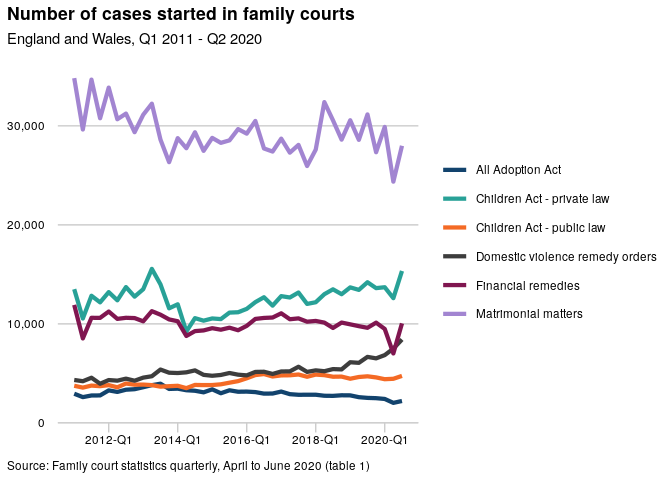
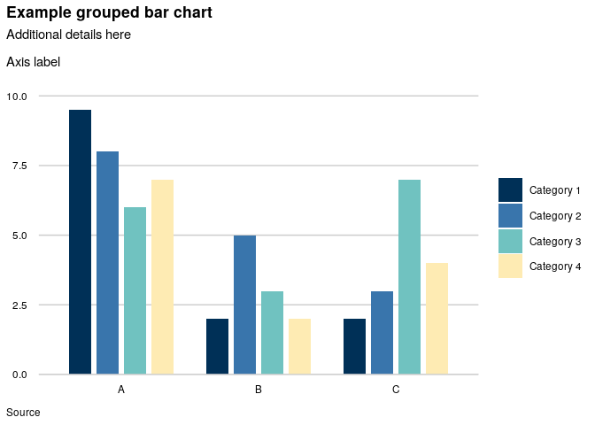

<!-- README.md is generated from README.Rmd. Please edit that file -->

# mojchart

<!-- badges: start -->
<!-- badges: end -->

mojchart is an R package that provides custom formatting for charts in
ggplot2. It includes a theme function based on [Government Analysis
Function
guidance](https://analysisfunction.civilservice.gov.uk/policy-store/data-visualisation-charts/)
and colour palettes based on [Analysis Function
guidance](https://analysisfunction.civilservice.gov.uk/policy-store/data-visualisation-colours-in-charts/)
and [MoJ corporate
branding](https://intranet.justice.gov.uk/guidance/communications/branding-templates/)
(MoJ internal link).

## Installation

You can install mojchart with:

``` r
install.packages("devtools")
devtools::install_github("moj-analytical-services/mojchart")
```

## Overview

The package provides a custom ggplot2 theme function, `theme_gss()`,
which is based on guidance from the Government Statistical Service and
Government Analysis Function.  

The package also provides colour palettes that can be added using the
custom scale functions `scale_colour_moj()` and `scale_fill_moj()`. The
colour palettes can also be returned as hex codes using `moj_palette()`.
Each palette contains six colours.

<!-- To access the individual colours defined by the package, call `moj_colours()` or -->
<!-- `govanal_colours()` -->
<!-- To obtain the hex codes for individual colours:\ -->
<!-- * `moj_colours()` provides MoJ corporate colours;\ -->
<!-- * `govanal_colours()` provides colours from the Government Analysis Function colour palettes\ -->
<!-- * `palette_colours()` provides the colours used in the mojchart colour palettes.\ -->
<!-- To display colour palettes: -->
<!-- * `display_palette()` displays a vector of colour hex codes; -->
<!-- * `display_scheme()` displays all the colour palettes within an mojchart colour scheme. -->
<!-- The function help pages (accessed using `?` or `help()` in RStudio) contain full details and examples. -->

## Theme function

The theme function `theme_gss()` is based on Analysis Function guidance
([Data
visualisation:charts](https://analysisfunction.civilservice.gov.uk/policy-store/?keyword=visualisation&area=&doctype=&submit=Go)).
It aims to minimise unnecessary visual elements and to assist with label
positioning. The theme allows for a main title, plus a subtitle for
statistical details. The data source can be shown in the caption below
the chart. To keep axis labels horizontal, `theme_gss()` suppresses the
ggplot2 y axis label; a label can instead be included within the ggplot2
subtitle if required (see [example 2](#example-2-grouped-bar-chart)
below).

`theme_gss()` includes a parameter to show or hide the x axis label, a
parameter to show or hide the x axis tick marks, and a parameter to
reverse the formatting of the x and y axes for use with `coord_flip()`.

## Colour palettes

The package provides three colour palettes taken from the Analysis
Function guidance [Data visualisation:
colours](https://analysisfunction.civilservice.gov.uk/policy-store/data-visualisation-colours-in-charts/)
(for categorical data, sequential data and “focus charts”) and five
colour palettes based on MoJ corporate colours. There are six colours in
each palette, but note that the Analysis Function guidance on the use of
colour advises using no more than four categories for line charts and
clustered or stacked bar charts.

The Analysis Function colour palettes have been designed around current
accessibility requirements. The colour palettes based on MoJ colours do
not meet current accessibility requirements for contrast ratios.

For MoJ corporate colours, there are two types of colour scheme: vibrant
and muted. The vibrant schemes use MoJ corporate colours directly. The
muted schemes are based on MoJ colours but with reduced saturation.
Reduced saturation was previously recommended in Government Statistical
Service guidance for shading areas, such as for bar charts.

For sequential colour palettes or continuous data, you could look at the
inbuilt [ggplot2
options](https://ggplot2-book.org/scales-colour#sec-colour-continuous),
or try the
[colorspace](https://cran.r-project.org/web/packages/colorspace/vignettes/colorspace.html)
package.

Running `palette_names()` returns the colour palette names.

``` r
library(mojchart)
palette_names()
#> [1] "muted1"        "muted2"        "muted3"        "vibrant1"     
#> [5] "vibrant2"      "govanal_bars"  "govanal_lines"
```

You can use `scale_colour_moj()` or `scale_fill_moj()` to apply a colour
palette to a ggplot2 chart, passing the number of colours and the name
of a colour palette as arguments. There is an optional `order` parameter
to change the colour order.

To obtain a sequence of colours as a vector, use `moj_palette()`, again
specifying the number of colours and the name of a colour palette. The
`display_colours()` function displays the sequence of colours.

``` r
pal <- moj_palette(n = 5, palette = "muted3")
pal
#> mojdarkblue    midblue1       teal2       pink1     yellow1 
#>   "#003057"   "#3975ac"   "#59a6a4"   "#f3bee0"   "#feebb3"
```

``` r
display_colours(pal)
```


All of the colour sequences available within each colour palette are
shown [here](man/additional-documentation/schemes.md).

## Accessing individual colours

`moj_colours()` provides the hex codes for all MoJ corporate colours.
`govanal_colours()` provides the Government Analysis Function colours.
`palette_colours()` provides all colours used in the mojchart colour
palettes. Running one of these functions with no arguments returns a
vector containing all of the available colours. Passing the names of
individual colours returns just those.

``` r
moj_colours("mojblue", "mojgreen")
#>   mojblue  mojgreen 
#> "#1d609d" "#30aa51"
```

## Accessibility

See the [Analysis Function
guidance](https://analysisfunction.civilservice.gov.uk/policy-store/data-visualisation-colours-in-charts/)
for a full discussion of accessibility considerations regarding the use
of colour in charts.

In general, accessibility decreases as you use more colours.

Of the colour palettes in this package, only the Analysis Function
palettes have been checked for contrast ratios that meet accessibility
requirements.

All of the colour palettes aim to be accessible to those with the most
common forms of colour blindness.

Below are two resources to help assess colour blindness accessibility.  

- To simulate how an image file could appear to individuals with forms
  of colour blindness:  
  <https://www.color-blindness.com/coblis-color-blindness-simulator/>
- To simulate the appearance of a colour palette of hex codes:  
  <https://davidmathlogic.com/colorblind/>

Note that for line charts, the Analysis Function guidance recommends
labelling lines directly rather than using a separate legend. The
[directlabels](http://directlabels.r-forge.r-project.org/) package
provides one way to implement this in R.

## Examples

The examples below show the use of `theme_gss()`, `scale_colour_moj()`
and `scale_fill_moj()`, together with various ggplot2 functions, to
create fully formatted charts. The data frames for the charts are
produced by two mojchart functions, `familystarts_reduced()` and
`bars()`.

### Example 1: line chart

- In this example note that the line thickness has been increased in
  `geom_line()` so that the colours stand out more, making the
  categories easier to identify.

``` r
library(mojchart)
library(ggplot2)

ggplot(familystarts_reduced(6), aes(x = year_qtr, y = count, colour = case_type)) +
  geom_line(linewidth = 1.5) +
  labs(title = "Number of cases started in family courts",
       subtitle = "England and Wales, Q1 2011 - Q2 2020",
       caption = "Source: Family court statistics quarterly, April to June 2020 (table 1)") +
  scale_y_continuous(expand = expansion(mult = c(0, 0.05)), label = scales::label_comma()) +
  zoo::scale_x_yearqtr(labels = scales::label_date("%Y-Q%q")) +
  expand_limits(y = 0) +
  theme_gss(xticks = TRUE) +
  scale_colour_moj(6, palette = "govanal_lines", order = c(1, 3, 2, 6, 4, 5))
```

<!-- -->

### Example 2: grouped bar chart

``` r
ggplot(bars(4), aes(x = col1, y = col3, fill = col2)) +
  geom_col(position = position_dodge2(padding = 0.2), width = 0.8) +
  labs(title = "Example grouped bar chart",
       subtitle = "Additional details here\n\nAxis label",
       caption = "Source") +
  scale_y_continuous(expand = expansion(mult = c(0, 0.05))) +
  expand_limits(y = 10) +
  theme_gss() +
  scale_fill_moj(4, palette = "muted2")
```

<!-- -->

### Example 3: horizontal bar chart

``` r
ggplot(bars(3), aes(x = col1, y = col3, fill = col2)) +
  geom_col(position = "dodge2", width = 0.8) +
  coord_flip() +
  labs(title = "Example horizontal bar chart",
       subtitle = "Additional details here\n",
       caption = "Source",
       y = "Axis label") +
  scale_y_continuous(expand = expansion(mult = c(0, 0.05))) +
  expand_limits(y = 10) +
  guides(fill = guide_legend(reverse = TRUE)) +
  theme_gss(flipped = TRUE, xlabel = TRUE) +
  scale_fill_moj(3, palette = "govanal_bars")
```

<!-- -->
