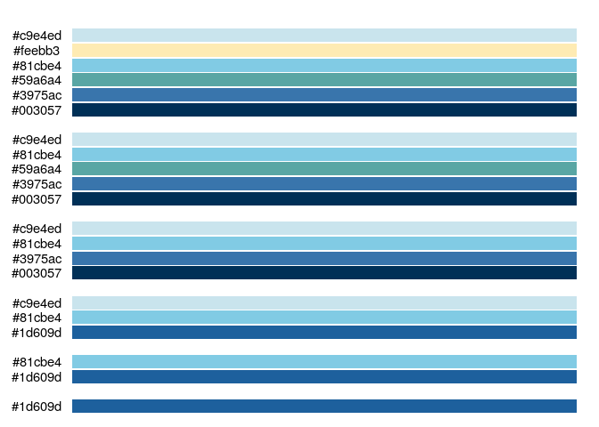
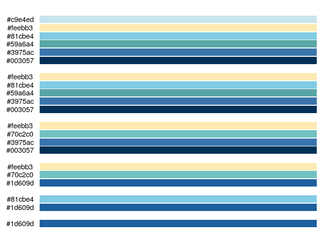
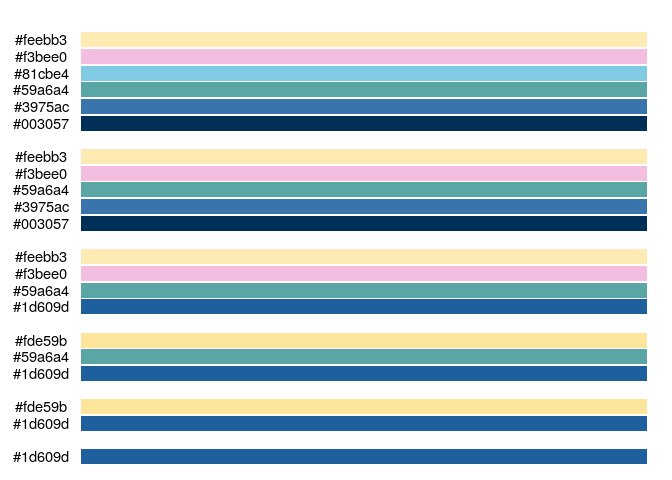
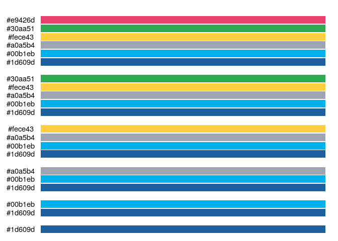
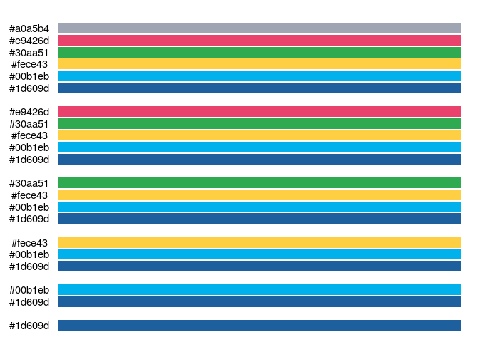
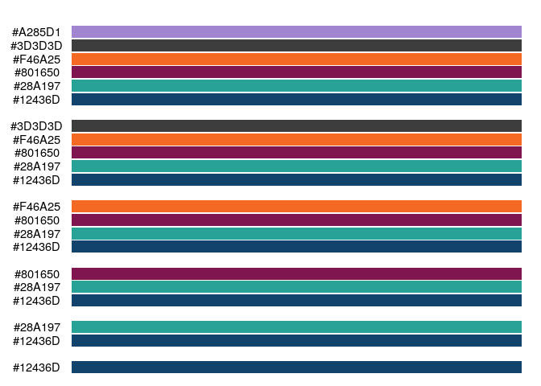
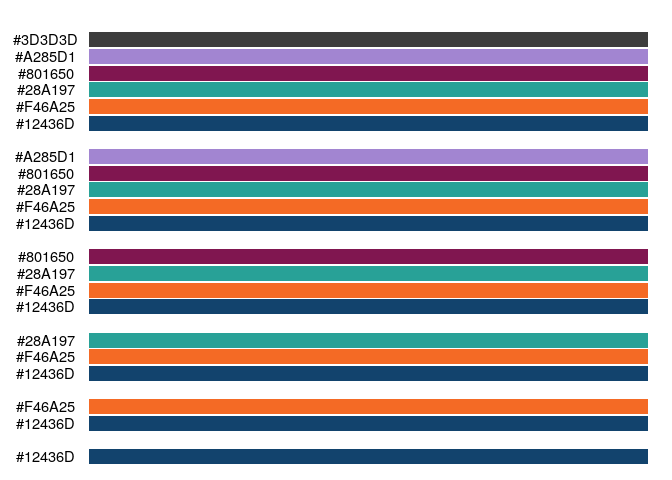

<!-- schemes.md is generated from schemes.Rmd. Please edit that file -->

# Colour schemes

### muted1

``` r
library(mojchart)
display_scheme("muted1")
```

<!-- -->

### muted2

``` r
display_scheme("muted2")
```

<!-- -->

### muted3

``` r
display_scheme("muted3")
```

<!-- -->

### vibrant1

``` r
display_scheme("vibrant1")
```

<!-- -->

### vibrant2

``` r
display_scheme("vibrant2")
```

<!-- -->

### govanal_bars

``` r
display_scheme("govanal_bars")
```

<!-- -->

### govanal_lines

``` r
display_scheme("govanal_lines")
```

<!-- -->
